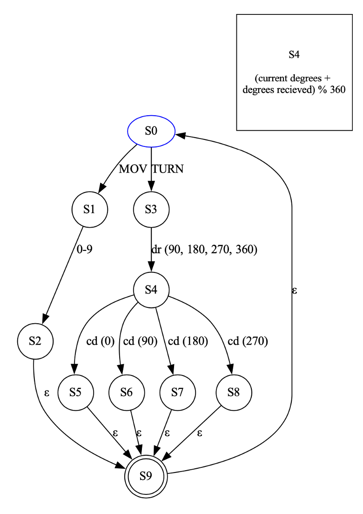

<h1 align="center">Robot Compiler</h1>

<h4 align="center">
  Created by:
</h4>

  Diego Partida Romero - A01641113 
  Carlos Alberto Veryan Peña - A01641147 
  Alan Antonio Ruelas Robles - A01641426

<h3 align="center">Students of Tecnológico de Monterrey Campus GDA</h3>

<h4 align="center">Implementation of Computational Methods (Gpo 601) - TC2037.601</h4>

<h4 align="center">June 11, 2023</h4>

---

# Deliverable 1: Machine state and CPU simulator

## Introduction

The goal of this deliverable is to implement a machine state and CPU simulator in Python. The simulator will control a robot by executing instructions provided in an assembly file and updating the state of the robot accordingly. The robot's movement will be represented on a 2-dimensional matrix.

## Files and Components

The deliverable consists of two main files: `cpu.py` and `automata.py`.

### `Cpu`

`cpu.py` is the core brain of the robot. It reads instructions from an assembly file (`instructions.asm`), executes each instruction, and updates the state of the robot on a 2-dimensional matrix. The file contains the following functions and variables:

- `print_trace(number_of_blocks)`: This function prints the trace of the robot's movement by marking the positions it has visited on the matrix.

- `change_direction(degrees)`: This function changes the direction of the robot by the specified number of degrees.

- `change_position(number_of_blocks)`: This function changes the position of the robot on the matrix by the specified number of blocks in the current direction.

- `do_instruction(inst)`: This function performs the specified instruction by calling the appropriate functions based on the instruction type and parameters.

- `read_file()`: This function reads the instructions from the `instructions.asm` file and returns a list of instructions.

- `generate_file()`: This function generates a file using an external compiler.

### `automata`

`automata.py` contains a function `plot(val)` that generates a visualization of an automata using the Graphviz library. The automata is defined using a list of tuples representing the states, transitions, and labels. The `main()` function in this file creates an automata and generates its visualization.

## Functionality

The CPU simulator reads instructions from the `instructions.asm` file, executes each instruction, and updates the state of the robot. The instructions are of two types: `TURN` and `MOV`.

- `TURN`: This instruction changes the direction of the robot by a specified number of degrees (90, 180, 270, or 360).

- `MOV`: This instruction moves the robot forward by a specified number of steps.

The robot's position and direction are updated accordingly on the 2-dimensional matrix. The `print_trace()` function marks the positions visited by the robot with an 'X' on the matrix.

## How to Use

1. Ensure that the `instructions.asm` file contains the desired set of instructions.

2. Run the `cpu.py` script using Python.

3. The script will read the instructions from the file, execute them one by one, and update the robot's state.

4. The final state of the robot, represented as a 2-dimensional matrix, will be displayed.

## Conclusion

The machine state and CPU simulator implemented in Python provides a way to control a robot by executing instructions and updating its state. The simulator accurately reflects the movements of the robot based on the instructions provided.
